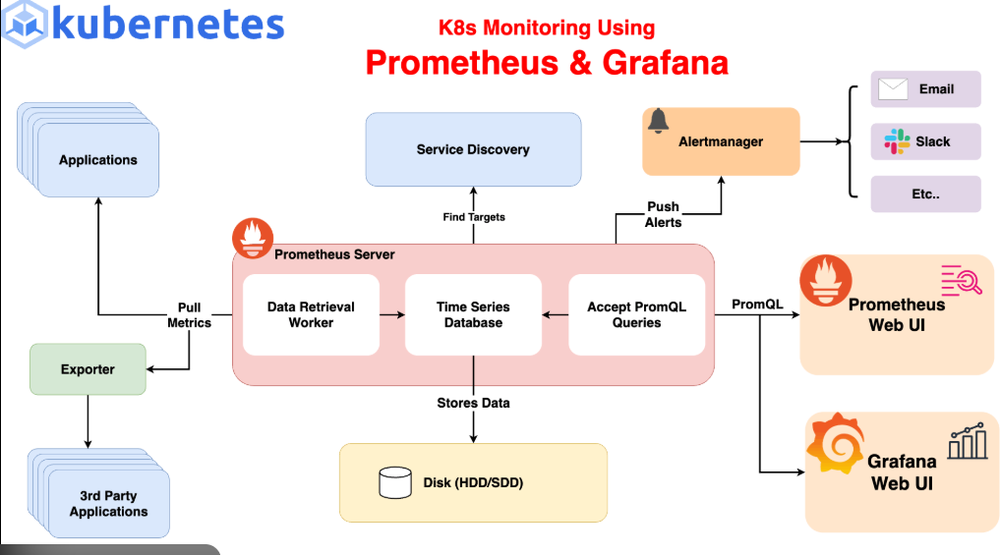
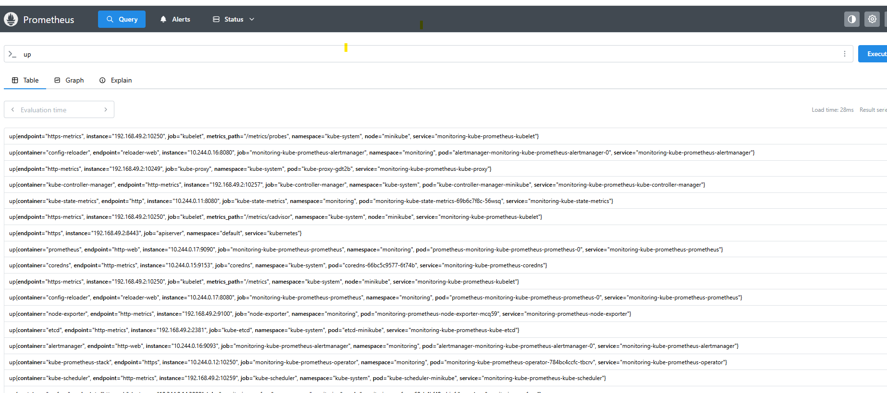
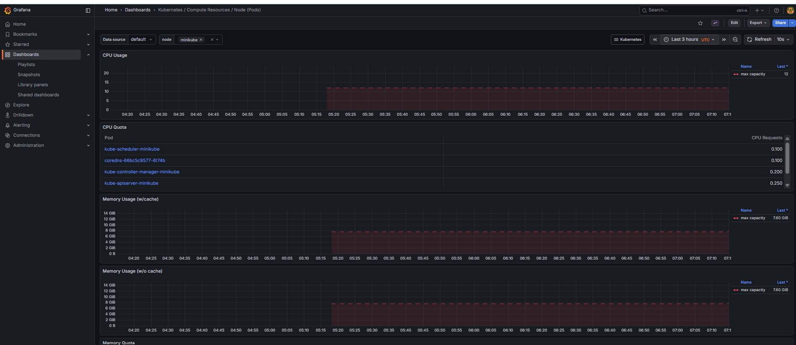

# Kubernetes Monitoring using Prometheus & Grafana

This project demonstrates an end-to-end monitoring setup for a Kubernetes cluster
using Prometheus and Grafana deployed via Helm on Minikube.

## 🚀 Tech Stack
- Kubernetes (Minikube)
- Prometheus
- Grafana
- Helm
- Docker
- Ubuntu (WSL)

## 📌 Project Overview
- Set up a local Kubernetes cluster using Minikube
- Installed Prometheus and Grafana using Helm (`kube-prometheus-stack`)
- Monitored node-level and pod-level metrics
- Explored Prometheus UI and PromQL queries
- Visualized metrics using Grafana dashboards
- Understood Kubernetes Services, ports, and port-forwarding

## 🏗 Architecture (Logical)
User Browser  
→ Grafana (port-forward)  
→ Prometheus  
→ Kubernetes Metrics (kubelet, node-exporter, kube-state-metrics)
## 🏗 Architecture Diagram




## Monitoring & Observability

###  Prometheus

Prometheus is used as the core metrics collection and time-series database.

**Key validations performed:**
- Verified target discovery using `up` metric
- Queried node CPU usage using PromQL
- Confirmed scraping of Kubernetes components (kubelet, node-exporter, etc.)

#### Prometheus Targets Check



### Grafana 

Grafana is used for visualization of Kubernetes metrics collected by Prometheus.

The Node dashboard displays CPU and memory usage for the Minikube node



## 🚨 Alerting with Prometheus & Alertmanager

This project includes custom alerting rules implemented using PrometheusRule CRDs.

### Custom Alert: HighNodeCPUUsage
- Metric: node_cpu_seconds_total
- Threshold: >70% CPU usage
- Duration: 2 minutes
- Severity: warning

### Alert Flow
1. Prometheus evaluates metrics using PromQL
2. Alert fires when condition is met
3. Alert is sent to Alertmanager
4. Alert is visible in Alertmanager UI

### Alert Validation
- CPU load was generated on the node
- Alert transitioned from Inactive → Firing
- Alert was visible in both Prometheus and Alertmanager dashboards


## ⚙️ Setup Steps

### 1. Start Minikube
```bash
minikube start --driver=docker

